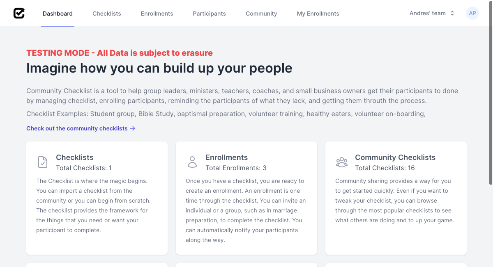
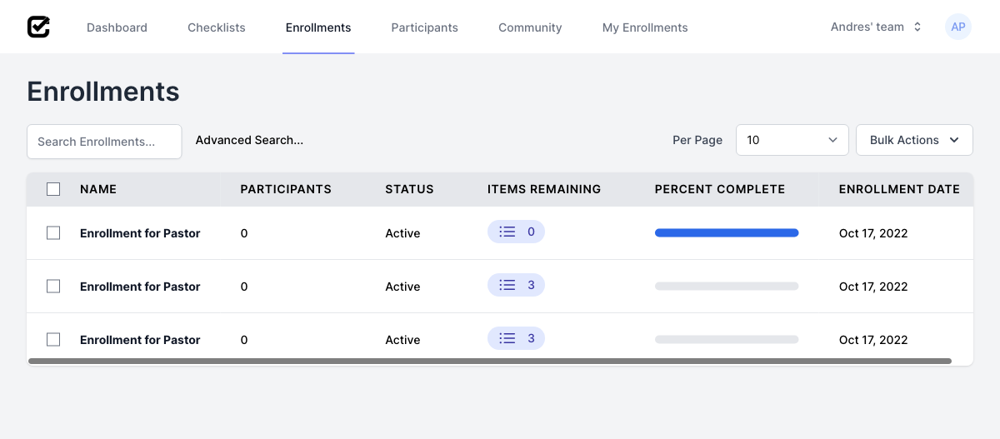
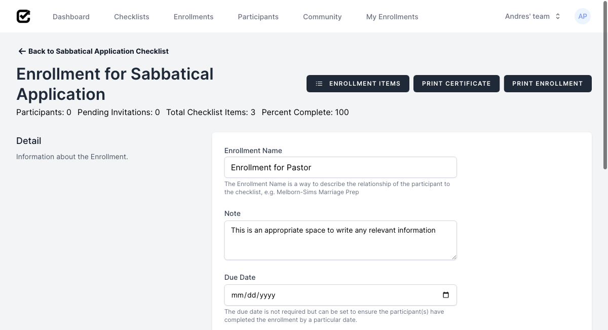
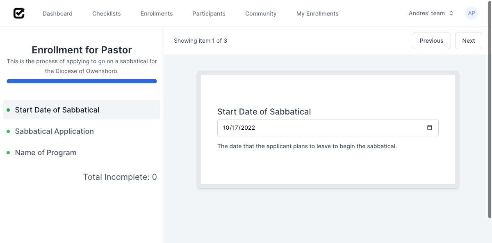
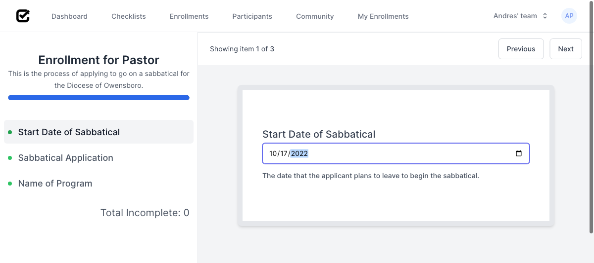
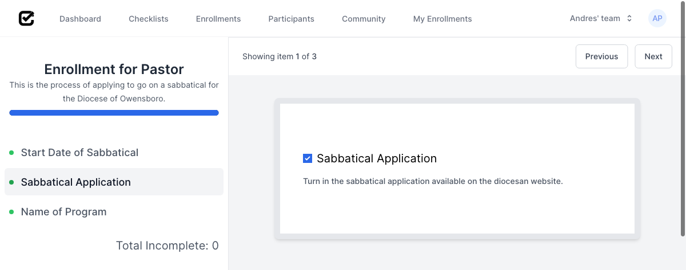
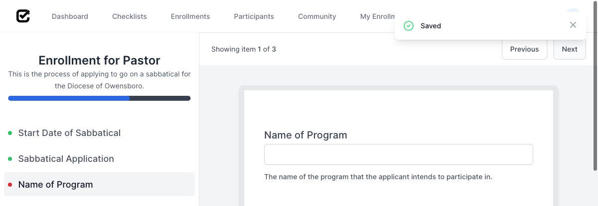

# Complete Enrollment
### How to complete a Checklist Enrollment
## Requirements
<!-- * [Signed Up](sign_up.md) -->
* [Logged In](log_in.md)
* One of the following:
    * [Imported Checklist](import_checklist.md)
    <!-- * [Created Checklist](create_checklist.md) -->
* [Created Enrollment](create_enrollment.md)
## Steps
1. Once successfully logged in, click on "Enrollments" to access your team's enrollments.

2. To access the "Enrollment for Pastor" enrollment, click on its name.

3. To complete the enrollment items, click on "Enrollment Items.

4. Fill the respective fields with the necessary data

4. Enter date and then click "Next"

6. Check the checkbox and then click "Next"

7. Enter name of program and then click "Next"

