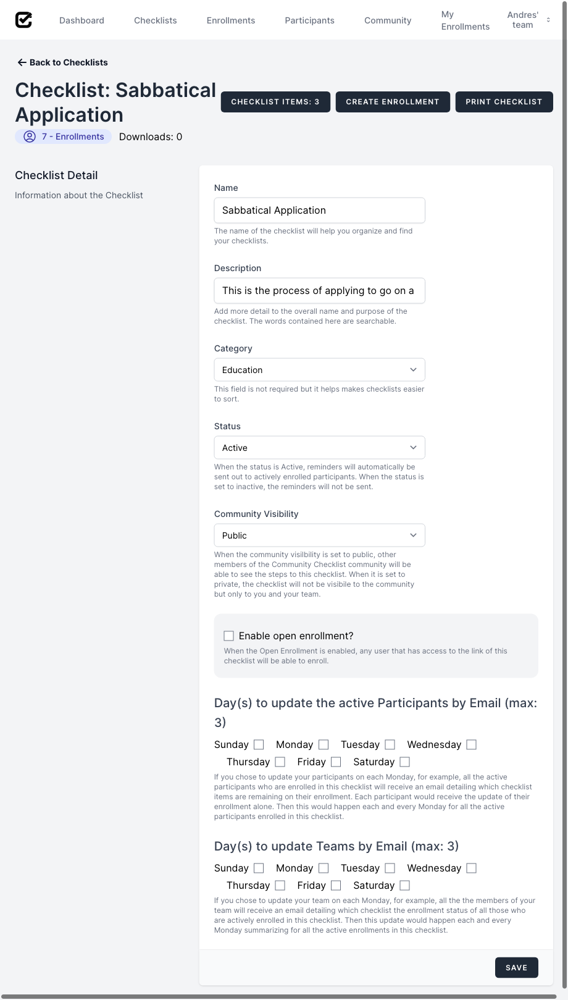

# Create Enrollment
### How to create an enrollment for an existing checklist
## Requirements
<!-- * [Signed Up](sign_up.md) -->
* [Logged In](log_in.md)
* One of the following:
  * [Imported Checklist](import_checklist.md)
  <!-- * [Created Checklist](create_checklist.md) -->
## Steps
1. Once successfully logged in, click on "Checklists" to access your team's checklists.  

2. To access the "Sabbatical Application" checklist, click on its name.  

3. To create an enrollment click on "Create Enrollment".  

4. To enroll yourself, you must first fill out the "Detail" form, only the Enrollment Name is required.  
 
5. Click "Save" to complete enrollment.  

6. To see the newly created enrollment, click on "Enrollments".  
{.center .small}