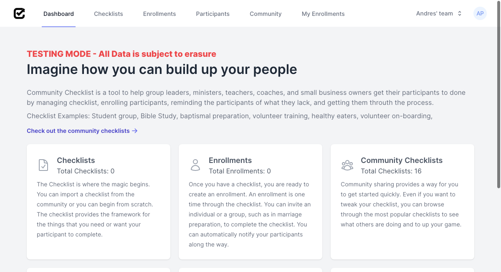
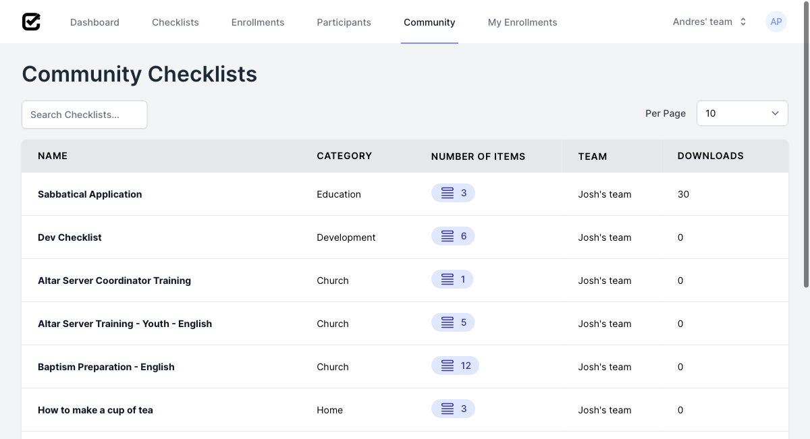
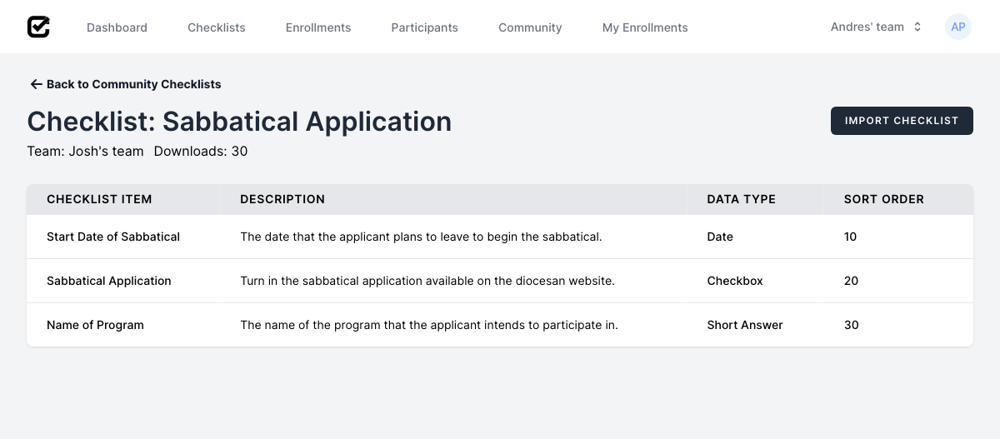
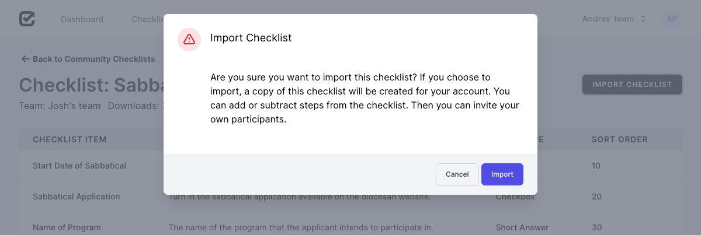
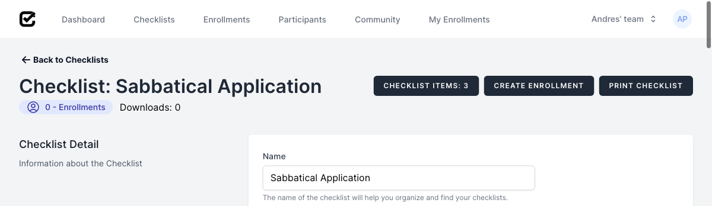

# How to import a Community Checklist
## Requirements
<!-- * [Signed Up](sign_up.md) -->
* [Logged In](log_in.md)
## Steps
1. Once successfully logged in, click on "Community" to access the community checklists.

2. To access the "Sabbatical Application" checklist, click on its name.

3. To import the checklist, click on it "Import Checklist"

4. Confirm importing the checklist by clicking on "Import"

5. Once successfully imported, you will see the following screen.
