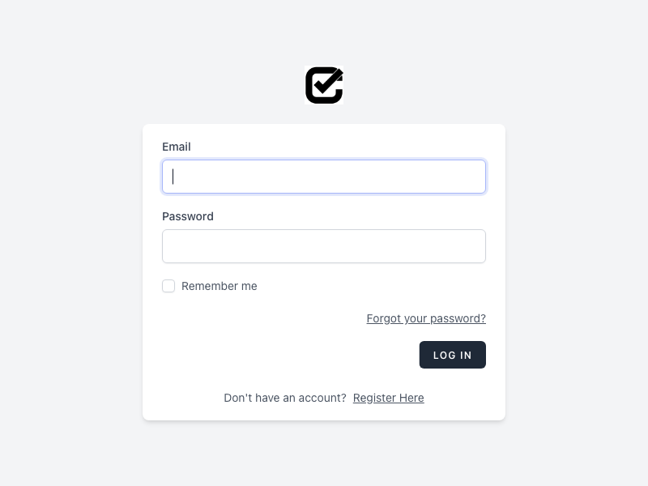
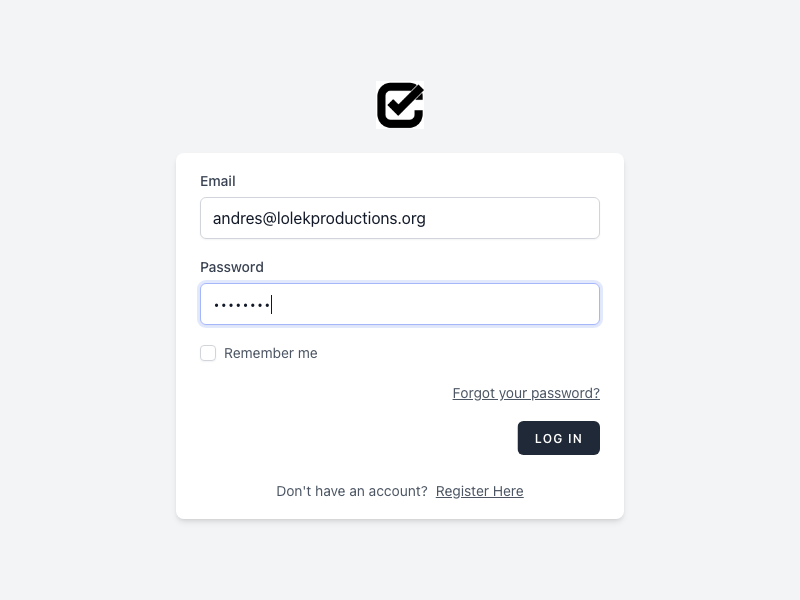
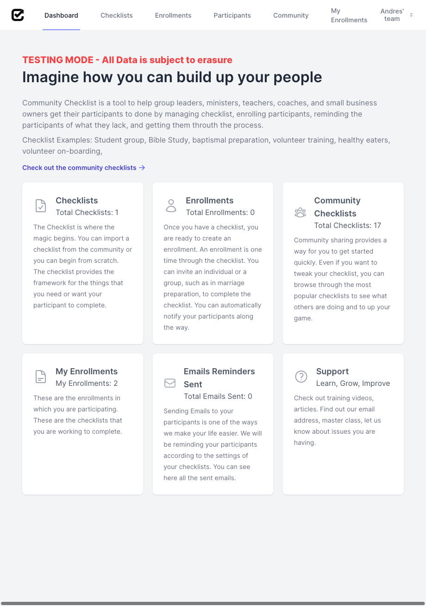

# How to log into Community Checklist
## Requirements
<!-- * [Signed Up](sign_up.md) -->
## Steps
1. Go to https://communitychecklist.org/login to access the login screen

1. Enter your user credentials and click on "Log In". You may click on "Remember Me" to save your credentials.

3. Once successfully logged in, you will see the following screen.
